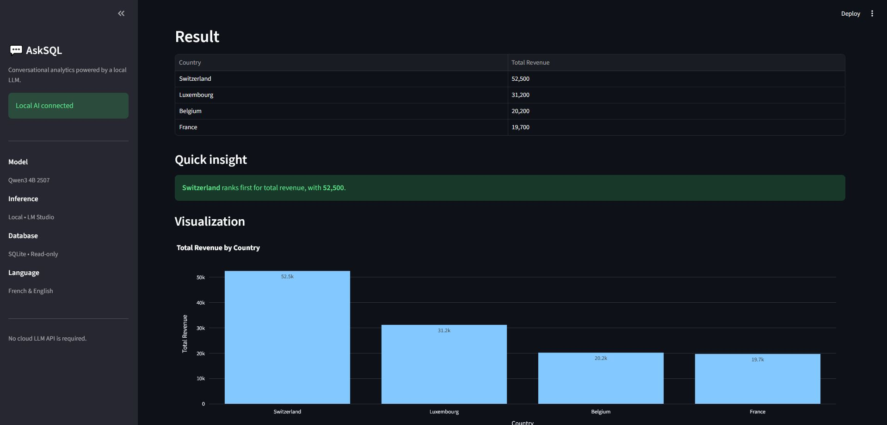
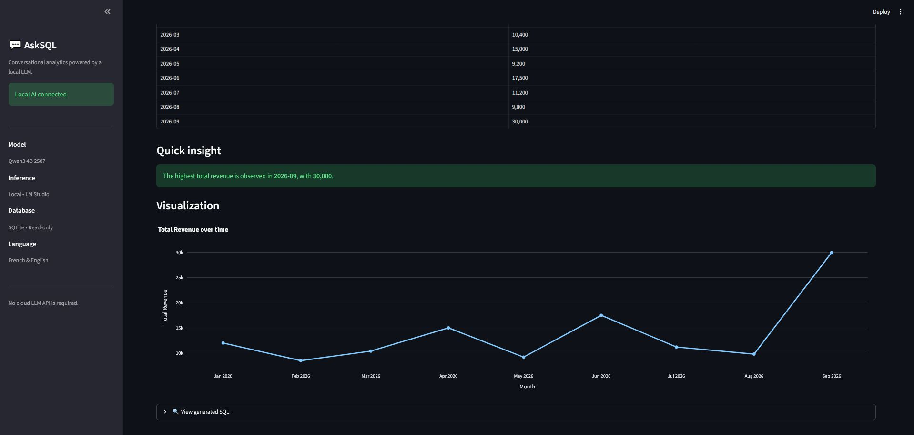

# 💬 AskSQL

### Conversational Analytics with a Local LLM

AskSQL is a lightweight conversational analytics application that allows business users to query a relational database using natural language instead of writing SQL.

Users can ask questions in **French or English**, such as:

> Which country generated the most revenue?

or:

> Quel produit a généré la marge totale la plus élevée en 2026 ?

A local language model translates the business question into SQL. The query is validated before execution, then the result is displayed as a KPI, table or interactive visualization.

---

## 🎯 Business Problem

Business users often depend on Data or BI teams for relatively simple analytical questions because they do not know SQL.

A traditional workflow may look like:

```text
Business User
      ↓
Data / BI Team
      ↓
SQL Query
      ↓
Extraction
      ↓
Business User
```

AskSQL explores a different approach:

```text
Business User
      ↓
Natural-Language Question
      ↓
Local LLM
      ↓
Validated SQL
      ↓
Database
      ↓
Analytical Result
```

The project demonstrates how Generative AI can support **self-service analytics** while keeping deterministic controls around database access.

---

### Ranking Analysis



### Time-Series Analysis




## ✨ Features

- Natural-language database queries
- French and English support
- Local LLM inference
- Natural Language → SQL generation
- SQL security validation
- Semantic validation
- Automatic SQL repair
- Read-only SQLite access
- KPI-style results
- Interactive tables
- Automatic visualizations
- Time-series detection
- Deterministic quick insights
- Query execution metrics
- Generated SQL inspection

---

## 🧠 Local AI

AskSQL uses **Qwen3 4B 2507**, running locally through **LM Studio**.

The application does not require a cloud LLM API for inference.

This architecture explores:

- local AI
- data privacy
- model efficiency
- low-cost inference
- conversational analytics
- on-device AI deployment

The LLM is used to translate business intent into SQL.

It does **not** receive direct access to the database.

---

## 🏗️ Architecture

```text
User Business Question
          │
          ▼
     Qwen3 4B
     Local LLM
          │
          ▼
     SQL Generation
          │
          ▼
   Security Validation
          │
          ▼
  Semantic Validation
          │
          ▼
 Auto-Repair if Needed
          │
          ▼
   SQLite Read-Only
          │
          ▼
       Pandas
          │
          ▼
 Plotly + Streamlit
          │
          ▼
 Analytical Result
```

---

## 🔒 SQL Safety

Generated SQL is never executed blindly.

AskSQL applies deterministic safeguards before database execution.

### Allowed

```sql
SELECT
WITH
```

### Blocked

```text
DELETE
UPDATE
INSERT
DROP
ALTER
CREATE
PRAGMA
ATTACH
DETACH
VACUUM
REPLACE
```

Multiple SQL statements are also rejected.

SQLite is opened using a **read-only connection**, creating two separate protection layers:

```text
Generated SQL
      ↓
Application Validation
      ↓
Read-Only Database
```

---

## ♻️ Automatic SQL Repair

LLMs can generate SQL that looks plausible but fails during execution.

AskSQL therefore includes a simple repair loop:

```text
Generate SQL
     ↓
Validate
     ↓
Execute
     │
     ├── Success → Return Result
     │
     └── Error
           ↓
      SQL + Error
      sent to LLM
           ↓
      Correct Query
           ↓
      Execute Again
```

The application allows a maximum of **one automatic correction** to avoid uncontrolled retry loops.

---

## 🧩 Semantic Validation

A syntactically valid query can still provide an incomplete business answer.

For example:

> Which country generated the most revenue?

Returning only:

```text
Switzerland
```

is technically an answer, but it does not show the metric supporting the result.

AskSQL therefore aims to return:

```text
Country        Total Revenue
Switzerland        52,500
```

For ranking questions, the application checks that both the ranked entity and the supporting metric are returned.

---

## 📊 Example Questions

AskSQL can answer questions such as:

> Which country generated the most revenue?

> Quel client a généré le plus de chiffre d'affaires en 2026 ?

> Quel produit a généré la marge totale la plus élevée en 2026 ?

> Montre-moi le chiffre d'affaires total par pays.

> Show monthly revenue for 2026.

---

## 📈 Automatic Visualization

AskSQL automatically selects a visualization when appropriate.

For categorical analysis:

```text
Revenue by Country
```

→ Bar chart

For temporal analysis:

```text
Monthly Revenue
```

→ Line chart

Interactive visualizations are generated with **Plotly**.

---

## 🛠️ Tech Stack

| Component | Technology |
|---|---|
| Language | Python |
| Local LLM | Qwen3 4B 2507 |
| LLM Runtime | LM Studio |
| Database | SQLite |
| Data Processing | Pandas |
| Visualization | Plotly |
| Application UI | Streamlit |
| LLM Client | OpenAI-compatible Python SDK |

---

## 📁 Project Structure

```text
ai-nl-to-sql/
│
├── app.py
├── create_database.py
├── sales.db
├── requirements.txt
├── README.md
├── .gitignore
│
└── screenshots/
    ├── ask-sql-ranking.jpg
    └── ask-sql-timeseries.jpg
```

---

## 🚀 Run Locally

### 1. Clone the repository

```bash
git clone <your-repository-url>
cd ai-nl-to-sql
```

### 2. Create a virtual environment

On Windows:

```powershell
python -m venv .venv
.\.venv\Scripts\Activate.ps1
```

### 3. Install dependencies

```bash
pip install -r requirements.txt
```

### 4. Install LM Studio

Install LM Studio and download:

```text
Qwen3 4B 2507
```

A quantized version such as:

```text
Q4_K_M
```

is suitable for machines with limited memory.

### 5. Start the LM Studio local server

AskSQL expects the OpenAI-compatible endpoint:

```text
http://127.0.0.1:1234/v1
```

Make sure the Qwen model is loaded and the LM Studio server is running.

### 6. Create the demo database

If required:

```bash
python create_database.py
```

### 7. Start AskSQL

```bash
streamlit run app.py
```

Then open:

```text
http://localhost:8501
```

---

## 🧪 Demo Dataset

The included SQLite database contains simplified sales data.

### `customers`

```text
customer_id
customer_name
country
segment
```

### `sales`

```text
sale_id
sale_date
customer_id
product
revenue
cost
```

The dataset is intentionally small because the goal of the project is to demonstrate the AI analytics architecture rather than database scale.

---

## ⚠️ Current Limitations

AskSQL is a portfolio prototype rather than a production-ready enterprise system.

Current limitations include:

- small demonstration database
- limited semantic model
- local model latency depends on hardware
- SQL validation relies on application rules rather than a full SQL AST parser
- no authentication
- no row-level security
- no enterprise data catalog
- no query cost estimation
- one automatic repair attempt only

A production implementation would require stronger access controls, auditing, database roles, schema permissions and systematic Text-to-SQL evaluation.

---

## 🔮 Possible Next Steps

Potential improvements include:

- PostgreSQL support
- SQLGlot AST validation
- query cost protection
- semantic layer and governed KPI definitions
- conversation history
- automatic ambiguity detection
- automatic schema discovery
- role-based access control
- Text-to-SQL evaluation dataset
- multiple LLM providers
- local/cloud model routing

---

## 💡 What This Project Demonstrates

### Data

- SQL
- relational modelling
- data aggregation
- analytical queries

### Generative AI

- local LLM deployment
- prompt engineering
- Text-to-SQL
- LLM error handling
- semantic interpretation

### AI Engineering

- probabilistic generation
- deterministic validation
- automatic repair
- model isolation

### BI / Analytics

- natural-language analytics
- KPI interpretation
- automatic visualization
- self-service analytics

### Governance

- read-only database access
- SQL restrictions
- validation before execution

---

## 📌 Key Design Principle

AskSQL deliberately separates the probabilistic AI component from deterministic execution controls.

```text
LLM
 │
 │ Generates
 ▼
SQL
 │
 │ Validated by deterministic rules
 ▼
Database
```

The LLM interprets business intent.

The application remains responsible for **security, validation and execution**.